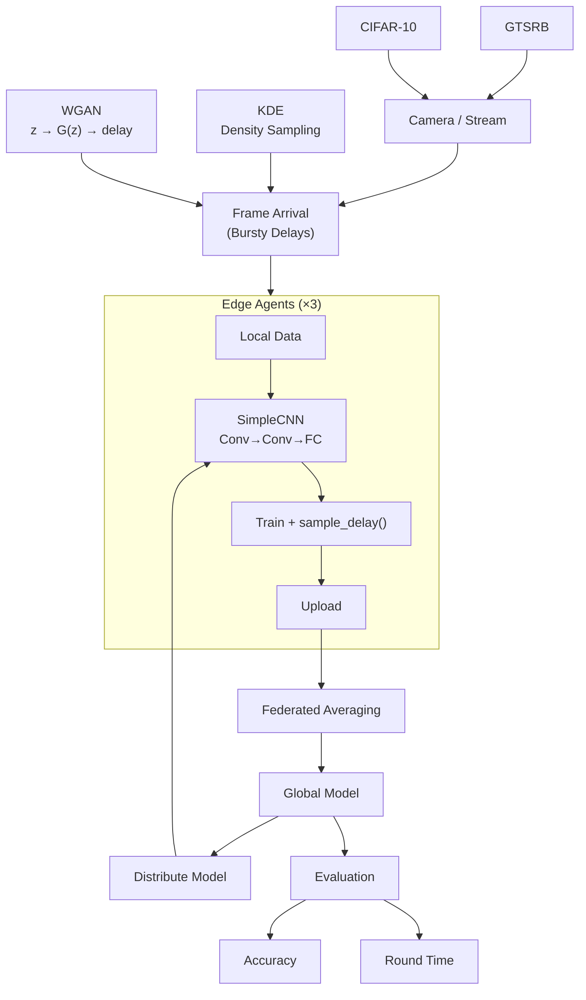

# Federated Edge Learning Simulation Diagram

```mermaid
flowchart TB

    %% -------------------
    %% DATA SOURCE
    %% -------------------
    GTSRB["GTSRB"] --> Camera
    CIFAR["CIFAR-10"] --> Camera

    Camera["Camera / Stream"] --> Timing

    %% -------------------
    %% DELAY GENERATION
    %% -------------------
    KDE["KDE<br/>Density Sampling"] --> Timing
    WGAN["WGAN<br/>z → G(z) → delay"] --> Timing

    Timing["Frame Arrival<br/>(Bursty Delays)"] --> Edge

    %% -------------------
    %% EDGE LEARNING
    %% -------------------
    subgraph Edge["Edge Agents (×3)"]
        Data["Local Data"] --> CNN
        CNN["SimpleCNN<br/>Conv→Conv→FC"] --> Train
        Train["Train + sample_delay()"] --> Upload
    end

    %% -------------------
    %% FEDERATED LOOP
    %% -------------------
    Upload --> Agg
    Agg["Federated Averaging"] --> Global
    Global["Global Model"] --> Broadcast
    Broadcast["Distribute Model"] --> CNN

    %% -------------------
    %% EVALUATION
    %% -------------------
    Global --> Eval
    Eval["Evaluation"] --> Acc
    Eval --> Time

    Acc["Accuracy"]
    Time["Round Time"]
```
